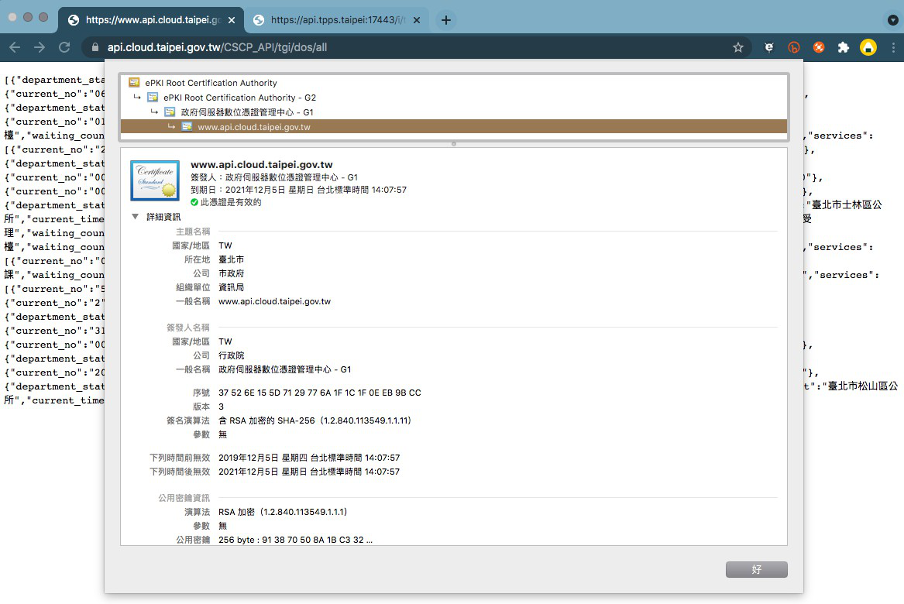
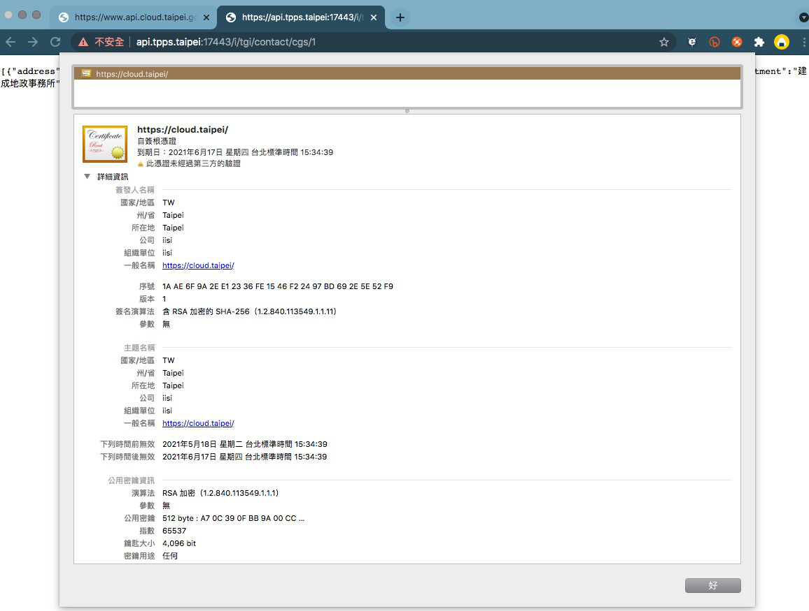

## Trello : 

>https://trello.com/c/pjU6hmGz/245-0616%E7%94%A2%E8%A3%BDcsr

>https://trello.com/c/SVKKBAqr/161-0526%E6%AD%A3%E5%BC%8F%E5%8D%80apitppstaipei%E6%86%91%E8%AD%89%E8%A8%AD%E5%AE%9A

---

## StepList

* 我們提供 CSR 檔案。
* Domain ( http://api.ttps.taipei/ )  網址要申請憑證。 改用Node.js
* 相關設定。

---

## CSR in Node.js ExpressAPI

### 1. 產生 `RSA` 加密的`私鑰`

    openssl genrsa -out private-key.pem 4096

> 4096 : 私鑰長度 ( 也可1024、2048 )

> -out : 輸出檔名

### 2. 用 `私鑰` 產生生成 `證書的鑰匙`

    openssl req -new -key private-key.pem -out csrreq.csr

> -new : 產生CSR（certificate signing request）

> -key : 讀取私鑰

### 3. 用公開金鑰 `X.509` 產生 `CA簽證` 的憑證

    openssl x509 -req -days 3650 -in csrreq.csr -signkey private-key.pem -out auth-cert.pem

> -days : 有效天數
---

## 證書輸入訊息

Country Name (2 letter code) [AU]:TW

State or Province Name (full name) [Some-State]:iisi

Locality Name (eg, city) []:台北市

Organization Name (eg, company) [Internet Widgits Pty Ltd]:市政府

Organizational Unit Name (eg, section) []:資訊局

Common Name (e.g. server FQDN or YOUR name) []:https://api.tpps.taipei

Email Address []:`?`

Please enter the following 'extra' attributes
to be sent with your certificate request

A challenge password []:iTap

An optional company name []:iisi

