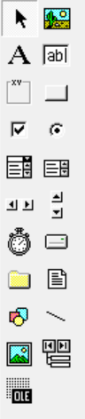

# 工具箱

每一物件都有其屬性。
可在「屬性視窗」觀看。

# 物件 共同屬性

Name: 指定物件之用
Caption: 顯示在視窗上的文字內容 (Lable 物件適用)
Text: 顯示在視窗上的文字內容 (Lable 物件不適用，其他物件大部份適用)
Height: 高度
Width: 寬度
ForeColor: 前景色
BackColor: 背景色

# 快捷鍵
F1：顯示MSDN説明
F2：顯示物件瀏覽器
F3：搜尋
F4：顯示當屬性表單
F5：運行程式
F7：切換到程式碼表單
F8：單一步驟程式
F9：中斷點

(參見)[https://king39461.pixnet.net/blog/post/403460402]